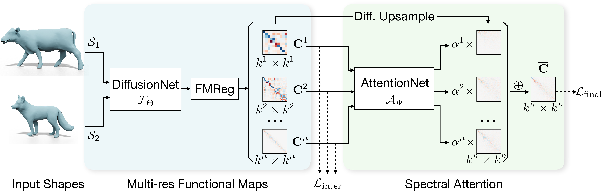

# Learning Multi-resolution Functional Maps with Spectral Attention for Robust Shape Matching
By Lei Li, Nicolas Donati, Maks Ovsjanikov. (NeurIPS 2022)

In this work, we present a novel non-rigid shape matching framework based on multi-resolution functional maps with spectral attention. Existing functional map learning methods all rely on the critical choice of the spectral resolution hyperparameter, which can severely affect the overall accuracy or lead to overfitting, if not chosen carefully. In this paper, we show that spectral resolution tuning can be alleviated by introducing spectral attention. Our framework is applicable in both supervised and unsupervised settings, and we show that it is possible to train the network so that it can  adapt the spectral resolution, depending on the given shape input. More specifically, we propose to compute multi-resolution functional maps that characterize correspondence across a range of spectral resolutions, and introduce a spectral attention network that helps to combine this representation into a single coherent final correspondence. Our approach is not only accurate with near-isometric input, for which a high spectral resolution is typically preferred, but also robust and able to produce reasonable matching even in the presence of significant non-isometric distortion, which poses great challenges to existing methods. We demonstrate the superior performance of our approach through experiments on a suite of challenging near-isometric and non-isometric shape matching benchmarks.



## Link

[Paper](https://arxiv.org/pdf/2210.06373)

## Citation
```
@inproceedings{li2022attentivefmaps,
    title={Learning Multi-resolution Functional Maps with Spectral Attention for Robust Shape Matching},
    author = {Li, Lei and Donati, Nicolas and Ovsjanikov, Maks},
    booktitle = {Advances in Neural Information Processing Systems},
    year = {2022}
}
```

## Dependencies
- CUDA 10.2
- Python 3.8
- Pytorch 1.11.0
- [torch-cluster](https://github.com/rusty1s/pytorch_cluster) 1.6.0

Other used Python packages are listed in `requirements.txt`.
It is preferable to create a new conda environment for installing the packages.

The docker image that has a complete running environment can be found [here](https://hub.docker.com/r/craigleili/attentivefmaps/tags).

## Data

The data and pretrained models can be found [here](https://1drv.ms/u/s!Alg6Vpe53dEDgbgRZB61zfVdUmd1jg?e=3bZWZn).
Extract the content of the zipped file to the root directory of the code.

## Training & Testing

```
python trainer_sup.py run_mode=train run_cfg=exp/log/<<folder_name_with_sup>>/config.yml
python trainer_unsup.py run_mode=train run_cfg=exp/log/<<folder_name_with_unsup>>/config.yml
```

## Use Pretrained Model

```
python trainer_sup.py run_mode=test run_ckpt=exp/log/<<folder_name_with_sup>>/ckpt_latest.pth
python trainer_unsup.py run_mode=test run_ckpt=exp/log/<<folder_name_with_unsup>>/ckpt_latest.pth
```

## Evaluation

First, compute geodesic distance matrices by running `scripts/computeGeoDistMat_***.m`.

Then,
```
python eval_corr.py --data_root exp/data --test_roots exp/log/<<folder1_name>> exp/log/<<folder2_name>>...
```

## References
1. Donati et al. [Deep Geometric Maps: Robust Feature Learning for Shape Correspondence](https://github.com/LIX-shape-analysis/GeomFmaps). CVPR 2020.
1. Sharp et al. [DiffusionNet: Discretization Agnostic Learning on Surfaces](https://github.com/nmwsharp/diffusion-net). TOG 2022.

[](http://creativecommons.org/licenses/by-nc/4.0/)

This work is licensed under a [Creative Commons Attribution-NonCommercial 4.0 International License](http://creativecommons.org/licenses/by-nc/4.0/).
